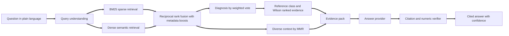
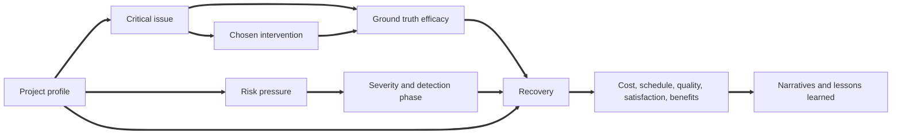

# Gantry AI

**Evidence grounded intelligence for complex project delivery problems.**

Gantry AI is a retrieval augmented generation system that answers the question every project leader eventually faces: *this is going wrong, what actually works?* It diagnoses a problem described in plain language, finds the most comparable cases in a base of 16,000 historical projects, ranks possible responses by how often they genuinely recovered projects like yours, and writes a cited answer whose every precedent and statistic is verified before it reaches you.

## Project brief

Large projects fail in remarkably consistent ways. Suppliers slip, scope expands, estimates prove optimistic, a single expert becomes a bottleneck, sponsors stop agreeing. Industry studies have repeated the same finding for decades: most major programmes finish late, over budget or both, and the causes are rarely new. Organisations capture this experience in post implementation reviews and lessons learned logs, yet that knowledge almost never reaches the next project lead at the moment it is needed. It sits in documents nobody reads, written in language nobody searches for, and it is almost never quantified.

General purpose chat assistants do not solve this. Asked how to rescue a failing supplier contract, a language model will produce a fluent, plausible list of generic advice with no evidence behind it, no way to tell which option is most likely to work in a given context, and a real risk of inventing precedents or statistics. For a decision that can move millions of pounds and months of schedule, fluency without evidence is a liability. Delivery leaders need answers that are specific to their situation, ranked by demonstrated outcomes, and traceable to the cases they came from.

Gantry AI was built to close that gap. It treats project knowledge as data rather than prose: every case carries a structured record of context, issue, response and measured result alongside its narrative. Retrieval finds the relevant precedents, a statistical evidence engine decides which responses to recommend using confidence bounds rather than anecdote, and the language model, when one is used, is confined to explaining that evidence and is checked for fabricated citations and numbers. The result behaves like a senior delivery advisor who has read every review in the portfolio, remembers the numbers, and always shows the source.

## What Gantry AI does

* **Diagnoses** a messy, multi part problem description into one or more of fifteen critical issue patterns, even when the wording shares no keywords with the case base.
* **Retrieves** the most comparable precedents with a hybrid of BM25 and dense semantic search, fused by reciprocal rank and diversified so the evidence is not a list of near duplicates.
* **Recommends** responses ranked by the lower bound of a Wilson confidence interval on full recovery, inside a reference class narrowed to your industry, methodology and contract where the data supports it.
* **Warns** against responses that reliably make things worse, such as adding generalist headcount to a late project.
* **Quantifies** what to expect next: median and P80 cost and schedule outcomes for your reference class, suggested contingency, and how much acting quickly improves the odds.
* **Predicts** delivery risk for a project profile before trouble starts, with the drivers behind each prediction and a prepared playbook for the most likely issues.
* **Verifies** every answer: cited project IDs must exist in the evidence and every percentage must match a number in the evidence, or the answer is replaced.
* **Exports** its knowledge as fine tuning data so any open model can learn the same grounded behaviour.

## Headline results

Measured by `python gantry.py evaluate` on 400 benchmark questions written in phrasing that never appears in the case narratives, 20 percent of them describing two problems at once.

<table>
<tr><th>Measure</th><th>Result</th></tr>
<tr><td>Retrieval precision at 10, full hybrid pipeline</td><td>0.913 (BM25 alone 0.843, dense alone 0.787)</td></tr>
<tr><td>Retrieval nDCG at 10, full hybrid pipeline</td><td>0.931</td></tr>
<tr><td>Primary diagnosis accuracy</td><td>92.2%</td></tr>
<tr><td>Top recommendation is a genuinely strong intervention</td><td>91.2%, against 58.3% and 75.9% for two naive RAG baselines</td></tr>
<tr><td>Answers recommending a harmful intervention</td><td>0.0%</td></tr>
<tr><td>Precision of the avoid list</td><td>99.7%</td></tr>
<tr><td>Answers passing citation and numeric verification</td><td>100%</td></tr>
<tr><td>End to end answer latency, cache disabled</td><td>about 4 ms median, under 7 ms p95</td></tr>
<tr><td>Full rebuild from nothing: dataset, index and models</td><td>about 13 seconds on a laptop CPU</td></tr>
</table>

The recommendation result is the one that matters most commercially. A naive RAG system that retrieves similar cases and repeats what those teams did inherits their mistakes, because people under pressure often choose the instinctive response rather than the effective one. Gantry separates *what was done* from *what worked* and is right roughly nine times in ten.

## How it works



**1. Query understanding.** The question is normalised with the same tokenizer and stemmer used at index time. A domain thesaurus detects likely issues (so "our lead engineer is resigning" is recognised as key person dependency), and synonym tables pick up industry, methodology and contract context such as "offshore wind" or "fixed price".

**2. Hybrid retrieval.** BM25 term weights are precomputed per document into a compressed sparse column matrix, so scoring all 16,000 cases is a single column slice and matrix vector product. The dense model is latent semantic analysis over unigrams and bigrams, reduced to 160 dimensions by truncated SVD. It needs no GPU, no model download and no network, and it captures synonymy such as vendor and supplier. Documents are expanded with the thesaurus of their own issue, which closes the vocabulary gap between how reviews are written and how managers speak.

**3. Fusion and boosting.** The two rankings are combined with reciprocal rank fusion, which is robust to their very different score scales. Detected issues and context apply soft multiplicative boosts, and caller supplied filters apply hard masks.

**4. Diagnosis.** The top cases vote for their issue, weighted by fused relevance and blended with the thesaurus prior. Up to three issues are reported, so compound problems are handled explicitly rather than collapsed into one.

**5. Evidence engine.** For each diagnosed issue, Gantry forms a reference class of every case with that issue and narrows it by industry, methodology and contract only while it keeps at least 200 cases. Within the class it computes, for every response used, the full recovery rate, the Wilson lower bound, lift over baseline, median cost and schedule ratios and lead time. Recommendations are ranked by the lower bound, so a response that worked 160 times in 200 outranks one that worked 9 times in 10. Responses performing far below baseline go on the avoid list. A timing analysis compares early and late responses, and an outlook reports P80 outcomes as contingency guidance.

**6. Context selection.** Maximal Marginal Relevance picks precedents that are both relevant and different from each other, and the best documented precedent for each recommended response is added so every recommendation has a citable example.

**7. Generation and verification.** The evidence is written into a compact evidence pack. The default extractive provider writes the answer deterministically from it. When Claude or a local Ollama model is selected, the model sees only the evidence pack and a strict system prompt. Either way the verifier checks that every cited ID is in the pack and every percentage matches a number in the pack. In strict mode a failing model answer is replaced with the extractive answer and the swap is reported.

## The dataset

The case base is a synthetic dataset of **16,000 projects and 49 columns** produced by `gantry_ai/generator.py`, a vectorised causal simulator that regenerates the full set in about 1.3 seconds from a fixed seed. It is designed to behave like a real portfolio: the numbers are driven by a causal model, and every narrative is composed from the numbers in its own row so text and fields never disagree.



* **Profiles** span 12 industries, 58 project types, 8 regions, 8 methodologies, 6 contract types and 4 organisation sizes, with budgets from GBP 60k to several hundred million and a combined portfolio of about GBP 230 billion.
* **Issues** are drawn from 15 critical patterns whose likelihood depends on the profile. Supplier failure is more likely with many vendors, regulatory delay with high regulatory exposure, key person dependency with small teams and high turnover.
* **Interventions** are chosen the way real teams choose them: experienced managers pick proven responses more often, and a share of teams reach for instinctive but damaging responses such as sustained overtime.
* **Recovery** depends on the ground truth efficacy of the intervention for the issue, sponsor engagement, manager experience, response speed, complexity and severity. Strong interventions fully recover about 61 percent of projects, harmful ones about 7 percent.
* **Outcomes** follow recovery: 21 percent delivered on target, 27 percent with variance, 41 percent late and over budget, 7 percent descoped and 5 percent cancelled, with median cost and schedule ratios of 1.14 and 1.12.

<table>
<tr><th>Column group</th><th>Columns</th></tr>
<tr><td>Identity and context</td><td>project_id, project_name, industry, project_type, region, delivery_methodology, contract_type, organisation_size</td></tr>
<tr><td>Time</td><td>start_date, planned_end_date, actual_end_date, planned_duration_days, actual_duration_days, schedule_ratio</td></tr>
<tr><td>Money and earned value</td><td>baseline_budget_gbp, final_cost_gbp, cost_ratio, cost_performance_index, schedule_performance_index</td></tr>
<tr><td>Delivery environment</td><td>team_size, stakeholder_count, vendor_count, dependency_count, scope_change_requests, requirements_volatility, technical_complexity, regulatory_exposure, sponsor_engagement, pm_experience_years, team_turnover_pct</td></tr>
<tr><td>Risk and issue</td><td>risk_register_size, risks_materialised, primary_risk_category, critical_issue, issue_severity, detection_phase, root_cause</td></tr>
<tr><td>Response and result</td><td>intervention_strategy, intervention_lead_time_days, recovery_success, outcome_status, quality_defect_rate, customer_satisfaction, benefits_realisation_pct, health_score</td></tr>
<tr><td>Narrative</td><td>problem_statement, resolution_narrative, lessons_learned, tags</td></tr>
</table>

The full column reference is in [docs/DATA_DICTIONARY.md](docs/DATA_DICTIONARY.md) and the ground truth efficacy matrix is in [data/ground_truth_efficacy.json](data/ground_truth_efficacy.json). Every value in the dataset is positive and dates use the YYYY/MM/DD format, so the file is clean to load anywhere.

## Quick start

Requires Python 3.10 or newer.

```bash
python install.py
python gantry.py all
python gantry.py ask "Our main supplier keeps missing delivery dates on a fixed price construction project. What should we do?"
```

`install.py` installs the requirements with the current interpreter. `gantry.py all` generates the dataset, builds the index, trains the risk models, runs the benchmark, checks the house style and runs the test suite.

To add the optional Claude integration:

```bash
python install.py llm
```

To run the API in a container, with the index built into the image:

```bash
docker compose up
```

## Using Gantry AI

### Command line

All options are written as `key=value` pairs.

<table>
<tr><th>Command</th><th>Purpose</th></tr>
<tr><td><code>python gantry.py ask "question" provider=extractive k=8</code></td><td>Cited answer with diagnosis, ranked actions, avoid list, outlook and confidence. Add <code>json=1</code> for the full structured result.</td></tr>
<tr><td><code>python gantry.py search "query" k=10 mode=hybrid</code></td><td>Most similar cases. Modes are hybrid, fusion, bm25 and dense.</td></tr>
<tr><td><code>python gantry.py recommend issue="Scope creep" industry=Software</code></td><td>Evidence table for every response to a known issue.</td></tr>
<tr><td><code>python gantry.py assess industry=Energy technical_complexity=8 sponsor_engagement=2</code></td><td>Risk prediction, drivers and playbook for a project profile.</td></tr>
<tr><td><code>python gantry.py evaluate queries=400</code></td><td>Benchmark, written to reports/evaluation.json and docs/EVALUATION.md.</td></tr>
<tr><td><code>python gantry.py export_sft grounded=1000</code></td><td>Fine tuning data in chat JSONL format.</td></tr>
<tr><td><code>python gantry.py serve host=0.0.0.0 port=8000</code></td><td>REST API with interactive documentation at /docs.</td></tr>
<tr><td><code>python gantry.py ui</code></td><td>Web interface.</td></tr>
<tr><td><code>python gantry.py test</code></td><td>Test suite.</td></tr>
<tr><td><code>python gantry.py check_style</code></td><td>Confirms the project contains no hyphen or dash characters.</td></tr>
</table>

### Example answer

Question: *Costs are spiralling on our offshore wind substation and contingency is almost gone.*

```text
### Diagnosis
Your situation most closely matches budget overrun (82% of the weighted evidence).
The closest precedents are [PRJ015974], [PRJ004963].

### Recommended actions
1. Earned value based cost control. Full recovery in 61% of 220 comparable cases
   (statistical lower bound 54%), against a 38% baseline for this problem. Median
   final cost 106% of budget and duration 104% of plan. Precedent: [PRJ010824].
2. Scope rebaselining with sponsor sign off. Full recovery in 61% of 171 comparable
   cases (statistical lower bound 53%). Precedent: [PRJ015974].

### Avoid
Adding general headcount to the team recovered fully in only 7% of 76 comparable cases.

### Act quickly
Starting within 34 days of detection gave full recovery in 71% of cases,
compared with 49% when the response started later.

### What to expect
The median project in this reference class finished at 111% of planned duration and
119% of budget. Holding P80 contingency means about 44% on cost and 32% on schedule.

### Confidence
High (0.92). 220 comparable cases support the top recommendation.
```

The answer above is abridged. Every answer also carries lessons from the closest precedents, the full evidence tables, the precedent cases, the verification report and a timing breakdown.

### REST API

<table>
<tr><th>Method and path</th><th>Purpose</th></tr>
<tr><td><code>GET /health</code></td><td>Liveness, case count and uptime. Never requires a key.</td></tr>
<tr><td><code>POST /ask</code></td><td>Full answer. Body: question, optional filters, k, provider, strict, include_evidence_pack.</td></tr>
<tr><td><code>POST /search</code></td><td>Similar cases. Body: query, filters, k, mode.</td></tr>
<tr><td><code>POST /recommend</code></td><td>Evidence ranked responses. Body: issue, industry, methodology, contract.</td></tr>
<tr><td><code>POST /assess</code></td><td>Risk prediction and playbook for a project profile.</td></tr>
<tr><td><code>GET /cases/{project_id}</code></td><td>One case by ID.</td></tr>
<tr><td><code>GET /stats</code> and <code>GET /options</code></td><td>Portfolio statistics and valid filter values.</td></tr>
</table>

```python
import httpx

response = httpx.post(
    "http://localhost:8000/ask",
    json={"question": "Users refuse to adopt the new patient record system", "filters": {"industry": "Healthcare"}},
    headers={"Authorization": "Bearer your_key"},
)
result = response.json()
print(result["answer"])
print(result["verification"])
```

Set `GANTRY_API_KEY` to require the bearer token on every endpoint except health. Responses are gzip compressed, CORS origins are configurable, and request bodies are validated with typed schemas.

### Web interface

`python gantry.py ui` opens four workspaces:

* **Ask Gantry**: question, filters and provider choice, the cited answer, headline metrics, evidence tables and charts, expandable precedent cases and the verification report.
* **Case explorer**: search the case base with any retrieval method and read individual cases.
* **Risk assessor**: profile a project and see predicted exposure, the drivers behind it and a prepared playbook.
* **Portfolio insights**: portfolio statistics and a per issue view of what works, optionally within one industry.

## Language model providers

<table>
<tr><th>Provider</th><th>How to enable</th><th>When to use it</th></tr>
<tr><td>extractive</td><td>Default, nothing to configure</td><td>Offline, deterministic, free and instant. The benchmark figures use it.</td></tr>
<tr><td>anthropic</td><td><code>python install.py llm</code>, then set <code>ANTHROPIC_API_KEY</code>, <code>GANTRY_LLM_PROVIDER=anthropic</code> and <code>GANTRY_MODEL</code> to a Claude model id from the Anthropic documentation</td><td>The most natural, conversational answers over the same evidence.</td></tr>
<tr><td>ollama</td><td>Run Ollama locally, set <code>GANTRY_LLM_PROVIDER=ollama</code> and optionally <code>GANTRY_MODEL</code></td><td>Fully private deployments where no data may leave the network.</td></tr>
</table>

Model ids are deliberately not hard coded, so upgrading the model is a configuration change rather than a code change. Whichever provider is used, the verifier runs on every answer and strict mode is on by default.

## Configuration

Every setting can be overridden with an environment variable.

<table>
<tr><th>Variable</th><th>Default</th><th>Meaning</th></tr>
<tr><td>GANTRY_LLM_PROVIDER</td><td>extractive</td><td>extractive, anthropic or ollama</td></tr>
<tr><td>GANTRY_MODEL</td><td>empty</td><td>Model id for the chosen provider</td></tr>
<tr><td>GANTRY_OLLAMA_URL</td><td>http://localhost:11434</td><td>Ollama server address</td></tr>
<tr><td>GANTRY_MAX_TOKENS</td><td>1200</td><td>Maximum answer length for model providers</td></tr>
<tr><td>GANTRY_API_KEY</td><td>empty</td><td>Enables bearer token authentication on the API</td></tr>
<tr><td>GANTRY_CORS</td><td>*</td><td>Comma separated list of allowed origins</td></tr>
<tr><td>GANTRY_ROWS and GANTRY_SEED</td><td>16000 and 42</td><td>Dataset size and random seed</td></tr>
<tr><td>GANTRY_EMBEDDING_DIMS</td><td>160</td><td>Dense embedding dimensions</td></tr>
<tr><td>GANTRY_BM25_K1 and GANTRY_BM25_B</td><td>1.4 and 0.72</td><td>BM25 saturation and length normalisation</td></tr>
<tr><td>GANTRY_RRF_K</td><td>60</td><td>Reciprocal rank fusion constant</td></tr>
<tr><td>GANTRY_CANDIDATE_POOL</td><td>400</td><td>Candidates kept from each retriever</td></tr>
<tr><td>GANTRY_EVIDENCE_MIN_CASES</td><td>200</td><td>Smallest reference class allowed when narrowing by context</td></tr>
<tr><td>GANTRY_CONTEXT_CASES</td><td>8</td><td>Precedents selected by MMR</td></tr>
<tr><td>GANTRY_MMR_LAMBDA</td><td>0.72</td><td>Relevance versus diversity balance</td></tr>
<tr><td>GANTRY_DATA_DIR, GANTRY_ARTIFACT_DIR, GANTRY_REPORT_DIR</td><td>data, artifacts, reports</td><td>Storage locations</td></tr>
</table>

## Evaluation

The benchmark generates questions from an independent phrasing bank, never from the narratives themselves, and scores them against the generator's ground truth. A retrieved case counts as relevant when it shares the question's issue, and scores higher when it also shares the industry.

<table>
<tr><th>Retrieval method</th><th>Precision at 10</th><th>MRR</th><th>nDCG at 10</th><th>Median latency</th></tr>
<tr><td>BM25 only</td><td>0.843</td><td>0.894</td><td>0.915</td><td>0.78 ms</td></tr>
<tr><td>Dense only</td><td>0.787</td><td>0.851</td><td>0.859</td><td>1.13 ms</td></tr>
<tr><td>Rank fusion only</td><td>0.825</td><td>0.870</td><td>0.884</td><td>1.42 ms</td></tr>
<tr><td>Full hybrid with query understanding</td><td>0.913</td><td>0.931</td><td>0.931</td><td>1.52 ms</td></tr>
</table>

<table>
<tr><th>Recommendation approach</th><th>Top recommendation is a strong intervention</th></tr>
<tr><td>Naive RAG, copy the most common response among similar cases</td><td>58.3%</td></tr>
<tr><td>Naive RAG, copy the most frequently successful response</td><td>75.9%</td></tr>
<tr><td>Gantry evidence engine</td><td>91.2%</td></tr>
</table>

<table>
<tr><th>Risk model</th><th>Held out result</th></tr>
<tr><td>Cost overrun above 20 percent</td><td>AUC 0.698</td></tr>
<tr><td>Schedule overrun above 25 percent</td><td>AUC 0.722</td></tr>
<tr><td>Cancellation or descoping</td><td>AUC 0.619</td></tr>
<tr><td>Likely issue classifier, 15 classes</td><td>Top 3 accuracy 38.8% against 6.7% chance for a single guess</td></tr>
</table>

The risk models predict from the profile alone, before any issue or response is known, so moderate AUC values are expected and honest: most of the variance in outcomes comes from how the team responds, which is exactly what the evidence engine addresses. The full report is regenerated by `python gantry.py evaluate` into [docs/EVALUATION.md](docs/EVALUATION.md).

## Efficiency

Gantry AI was engineered to be fast and cheap to run at every stage.

* **No GPU, no model downloads, no vector database.** The whole stack is numpy, scipy, pandas, FastAPI and Streamlit. Artifacts total about 25 MB.
* **Precomputed BM25.** Term weights are computed once at build time, so query scoring is one sparse slice and one product, under a millisecond for 16,000 documents.
* **Dense search as one matrix product.** Queries are folded into the SVD space with a lookup and a small product, then scored against memory mapped float32 embeddings.
* **Partial sorting.** Top k selection uses argpartition instead of full sorts.
* **Vector statistics.** Reference classes, recovery rates and confidence bounds are computed with integer codes and bincount, not loops over rows.
* **Fast cold start.** Arrays are memory mapped, so the engine loads in about half a second and several API workers can share the same pages.
* **Thread safe LRU cache.** Repeated questions are answered from memory.
* **Measured end to end.** A complete cited answer takes about 4 milliseconds, and a full rebuild of dataset, index and models takes about 13 seconds.

## Reliability and safety

* **Recommendations come from statistics, not from the language model.** The model can only explain evidence the engine selected.
* **Conservative ranking.** Wilson lower bounds prevent small, lucky samples from being recommended, and a response is only recommended when its lower bound is close to or above the baseline.
* **Verification on every answer.** Citation precision and numeric grounding are computed for each answer and returned with it.
* **Strict mode.** Model answers that fail verification are replaced by the extractive answer, and model outages fall back the same way.
* **Honest confidence.** Each answer states its confidence with reasons: evidence volume, agreement between retrievers, and how clearly the diagnosis stands out. Off topic questions are recognised and answered with low confidence rather than invented advice.
* **Explainable risk.** Every risk prediction lists the factors that raise or lower it.

## Fine tuning data

`python gantry.py export_sft` writes chat format JSONL to `data/sft/gantry_sft.jsonl` with two record types. Grounded records pair a full evidence pack with a verified cited answer, teaching any open model to answer strictly from retrieved evidence. Case records pair a single problem with its documented response and lesson, distilling the case base into the model. A 50 record sample is included at [data/sft_sample.jsonl](data/sft_sample.jsonl).

## Commercial value

* **PMOs and portfolio offices** get an always available advisor that turns their own lessons learned into ranked, quantified guidance, and a consistent way to challenge recovery plans at steering meetings.
* **Consultancies and delivery partners** can package their accumulated engagement history as a differentiating product, answering client questions with evidence from hundreds of comparable engagements.
* **Project controls and cost teams** get reference class outlooks and P80 contingency guidance grounded in comparable outcomes rather than optimism.
* **Insurers, lenders and investment committees** can use the risk assessor to price and screen delivery risk from a project profile.
* **Software vendors** in project and portfolio management can embed the API to add an evidence based advisor to existing tools.

The economics are favourable: the default configuration runs on a single small CPU instance with no per query model cost, and the optional model providers can be switched on only where conversational answers add value.

## Using your own portfolio data

The synthetic dataset demonstrates the system end to end, and the same pipeline accepts real data. Map your post implementation reviews, lessons learned logs and project controls data onto the columns in the data dictionary, keep the vocabulary of issues and interventions in `gantry_ai/vocab.py` aligned with your organisation's taxonomy, place the file at `data/gantry_projects.csv` and run `python gantry.py build`. The evaluation harness can then be pointed at questions written by your own delivery leads.

## House style

The project follows a strict typographic rule: there is no hyphen or dash character anywhere, not in the data, the documentation, the file names or the source code. Arithmetic uses the operator and numpy function forms, commands use `key=value` options instead of flags, and every piece of text that leaves the system, including model output, passes through a sanitiser. The rule is enforced by `python gantry.py check_style` and by the test suite.

## Project structure

```text
gantry.py                    entry point for every command
install.py                   dependency installer
requirements.txt             core requirements
requirements_llm.txt         optional Claude SDK
Dockerfile and compose.yaml
gantry_ai/
    vocab.py                 industries, issues, interventions and the efficacy matrix
    generator.py             vectorised causal dataset generator
    narratives.py            problem, resolution and lesson writers
    schema.py                column documentation
    text.py                  tokenizer and stemmer
    index.py                 BM25 and dense index build and load
    retriever.py             query understanding, fusion, diagnosis and MMR
    evidence.py              reference classes, Wilson ranking and outlooks
    risk_model.py            logistic and softmax risk models
    answer.py                evidence pack and extractive answer writer
    llm.py                   providers and the grounding verifier
    engine.py                orchestration, caching and public operations
    evaluate.py              benchmark harness
    sft.py                   fine tuning export
    api.py                   FastAPI service
    ui_app.py                Streamlit interface
    cli.py                   command line
    style.py                 house style scanner
    config.py and utils.py   settings and shared helpers
data/                        dataset, ground truth and fine tuning sample
docs/                        data dictionary and evaluation report
reports/                     machine readable evaluation results
tests/                       unit and integration tests
```

## Testing

`python gantry.py test` runs 46 tests covering the dataset shape and integrity, determinism of the generator, the presence of the efficacy signal, tokenisation, index correctness and speed, filters, evidence ranking against the ground truth for every issue, multi issue diagnosis, off topic handling, verifier behaviour against fabricated citations and numbers, provider failure fallback, every API endpoint including validation and authentication, the evaluation harness, and the house style across the whole project.

## Limitations and roadmap

* The dataset is synthetic. It is realistic in structure and deliberately causal, but figures describe the simulation rather than any real portfolio. Real deployments should rebuild on real data.
* The dense model is latent semantic analysis, chosen for speed and zero dependencies. A neural embedding backend would add value for highly varied real world text and fits behind the same interface.
* Planned: connectors for common project tools, incremental index updates, per organisation reference class weighting, and a feedback loop that records which recommendations teams adopted and how they fared.

## License

Released under the MIT License. See [LICENSE](LICENSE).
